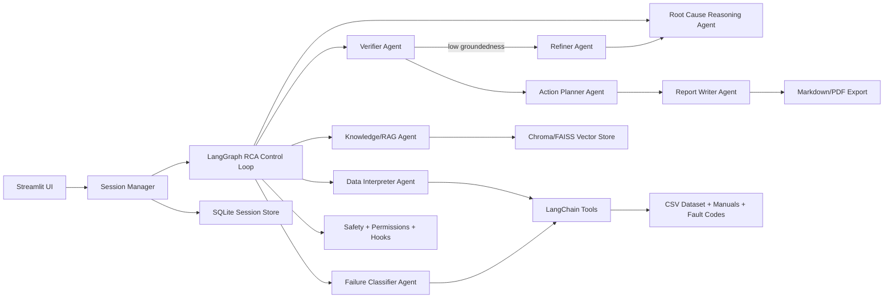

# Agentic Root Cause Analysis Copilot Architecture

## Purpose

This project is a production-style reference implementation for an Agentic Root Cause Analysis (RCA) Copilot for industrial equipment faults. It combines predictive maintenance datasets, deterministic analytics, retrieval over manuals/SOPs, and a LangGraph multi-agent control loop to produce evidence-grounded engineering decision-support reports.

The system is not a simple chatbot. It is a stateful engineering workflow with explicit tools, reusable skills, safety gates, verifier/refiner logic, trace persistence, and structured JSON handoffs between agents.

## High-Level Architecture

## Core Components

### 1. Streamlit Application

The UI includes:

- Dashboard: dataset overview, failure distribution, sensor trends, anomaly indicators.
- RCA Console: select a record/time window, ask an engineering question, run the agent graph.
- Evidence Viewer: sensor, manual/SOP, fault-code, and summarized agent evidence.
- Evaluation Dashboard: groundedness, faithfulness, hallucination risk, verifier decision, refinement count.
- Session History: reload previous RCA runs.
- Report Export: Markdown output, with PDF-ready Markdown saved under `exports/`.

### 2. LangGraph Control Loop

The graph is the application harness:

1. Data Interpreter Agent
2. Failure Classifier Agent
3. Knowledge/RAG Agent
4. Root Cause Reasoning Agent
5. Verifier Agent
6. Conditional retry/refinement
7. Action Planner Agent
8. Report Writer Agent

The verifier routes low-confidence or poorly grounded answers to the Refiner Agent. Refinement is capped by configuration to prevent runaway loops.

### 3. LangChain Tools

Tools are deterministic, auditable helpers:

- Dataset loading
- Statistical summary
- Anomaly detection
- Failure/fault lookup
- Manual/RAG search
- Plot/chart generation
- RCA report generation

Tools are wrapped with permission checks, PII detection, prompt-injection screening, and lifecycle hooks.

### 4. Reusable Skills

Reusable skills are declared in `skills.md` and loaded dynamically. The registry supports:

- Skill name and description
- Inputs and outputs
- Allowed tools
- Safety constraints
- Example usage

These skills are referenced during prompt assembly and tool authorization.

### 5. Dynamic Prompt Assembly

Prompts are assembled from:

- User role
- Selected model provider
- Task type
- Retrieved context
- Safety rules
- Available tools
- Skill definitions loaded from `skills.md`

All agent handoffs use structured JSON-like dictionaries. The application exposes reasoning summaries and evidence, but not hidden chain-of-thought.

### 6. Provider Abstraction

The app is local-first with Ollama and supports optional cloud providers:

- Ollama via `ChatOllama`
- OpenAI via `ChatOpenAI`
- Anthropic via `ChatAnthropic`

If an LLM provider is unavailable, the graph falls back to deterministic template reasoning so the demo still runs.

### 7. Safety and Permissions

The safety layer includes:

- Tool access control
- PII pattern detection
- Prompt injection detection
- Jailbreak detection
- Unsafe engineering advice filtering
- Decision-support disclaimer

The app avoids giving final certification or bypassing lockout/tagout, inspection, or OEM procedures.

### 8. Persistence

SQLite stores:

- Sessions
- User queries
- Dataset metadata
- RCA reports
- Agent traces
- Evaluation scores

This makes the workflow auditable and replayable.

## Public Dataset Strategy

The primary supported dataset is the AI4I 2020 Predictive Maintenance Dataset from UCI. The app can load user-uploaded CSVs with similar fields and includes a loader script that downloads AI4I when network access is available.

Default expected AI4I columns:

- `UDI`
- `Product ID`
- `Type`
- `Air temperature [K]`
- `Process temperature [K]`
- `Rotational speed [rpm]`
- `Torque [Nm]`
- `Tool wear [min]`
- `Machine failure`
- `TWF`, `HDF`, `PWF`, `OSF`, `RNF`

## Engineering Manager Demo Narrative

1. Load AI4I dataset.
2. Select a failed machine record.
3. Ask: "Why did this equipment likely fail and what should maintenance check first?"
4. The graph interprets sensors, classifies likely failure modes, retrieves manual/SOP evidence, generates hypotheses, verifies grounding, refines if needed, and produces a structured RCA report.
5. The report explains evidence, alternatives, confidence, safety notes, recommended checks, and an action plan.

